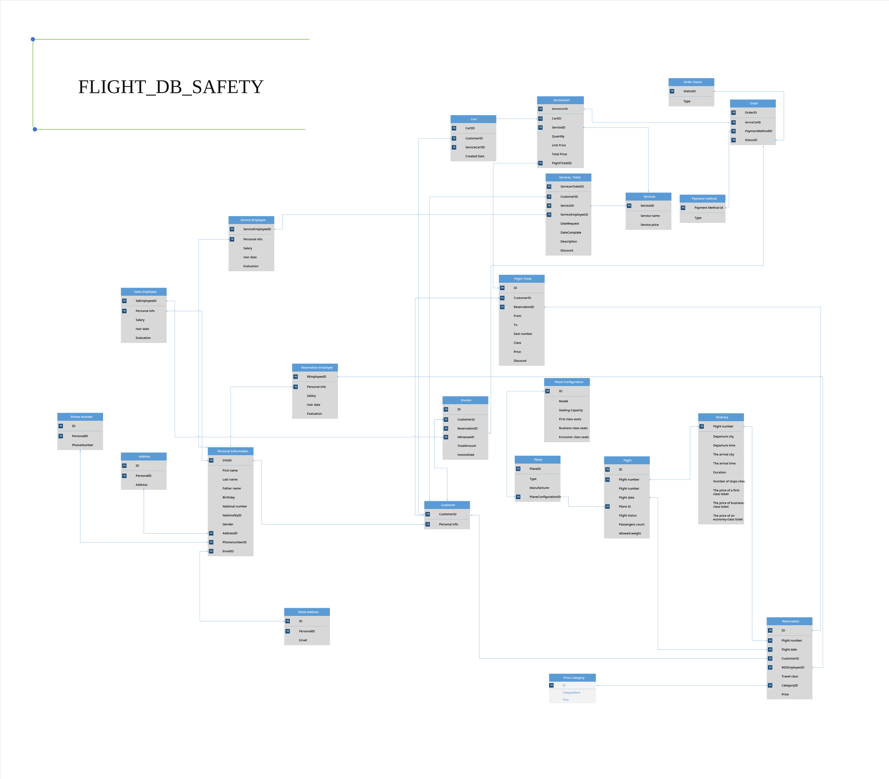

# 🛫 flight-db-safety  – SQL Database Project

A structured SQL database project designed to manage and ensure the safety of flight operations.  
This project provides a schema for storing, querying, and analyzing flight-related data with a focus on safety, passengers, and operations.

## 🔧 Features
- Manage flight schedules, aircraft, and crew
- Store passenger information and booking records
- Track safety checks and maintenance logs
- Query flight history and incidents
- Relational schema with foreign keys for data integrity

## 🛠 Tech Stack
- SQL (MySQL / PostgreSQL compatible)
- ERD (Entity Relationship Diagram) for schema design

## 🚀 Usage
1. Clone the repository:
   ```bash
   git clone https://github.com/mnzeiter/flight-db-safety.git
   ```
2. Import the database schema:
   ```bash
   mysql -u root -p < flight_db_sefty.sql
   ```
   *(or use your preferred SQL client)*
3. Load sample data (if provided):
   ```bash
   mysql -u root -p < sample_data.sql
   ```
4. Run queries to explore the database:
   ```sql
   SELECT * FROM flights;
   SELECT * FROM passengers;
   ```

## 📁 File Structure
```
flight-db-safety /
├── flight_db_sefty.sql      # Main schema
├── README.md                # Documentation
└── erd.png                  # ER diagram (if available)
```

## 📷 Screenshots / ERD


---

## 🌐 Connect with Me
- 💼 [LinkedIn](https://linkedin.com/in/mozeiter)
- 🌍 [Portfolio Website](https://mohammadalzeiter.com)
- 📧 Email: mohammadalzeiter@outlook.com

---

✨ A robust SQL database project for managing and analyzing flight operations with a focus on **safety and reliability**.
